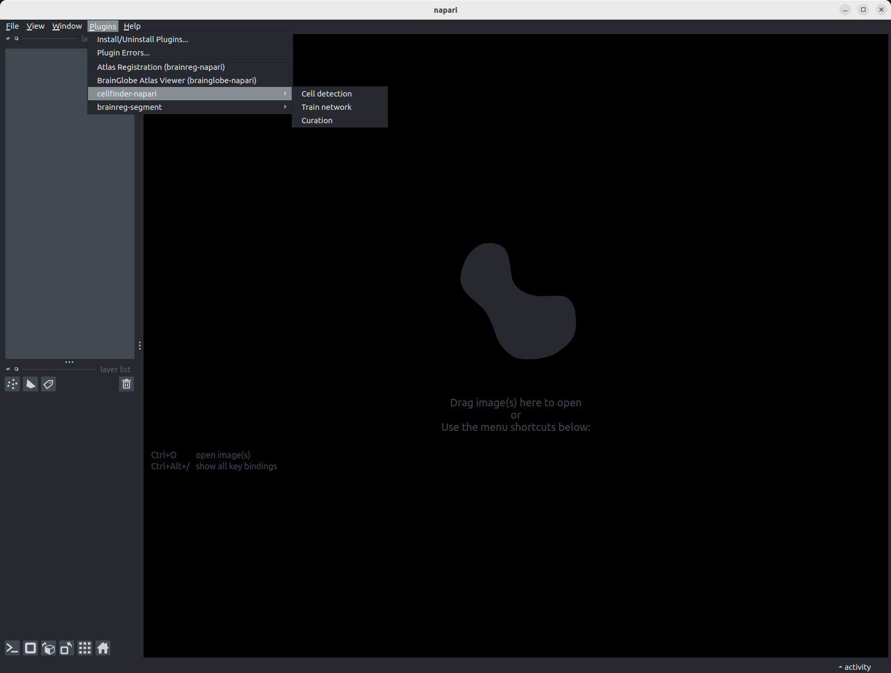

# Installing BrainGlobe in a fresh conda environment

1. Navigate to this folder from a terminal.
2. Run `conda env create -f environment.yaml`
3. Run `conda activate brainglobe-environment`

You are now in a fresh conda environment named `brainglobe-environment` with all BrainGlobe plugins installed!

## Checking that the installation worked

1. In a terminal, run `conda list | grep 'cellfinder*\|brain*\|bg-*'`. The output should be similar to the table below
```
bg-atlasapi               1.0.2                    pypi_0    pypi
bg-space                  0.6.0                    pypi_0    pypi
brainglobe-napari-io      0.1.5                    pypi_0    pypi
brainreg                  0.4.0                    pypi_0    pypi
brainreg-napari           0.1.1                    pypi_0    pypi
brainreg-segment          0.2.16                   pypi_0    pypi
cellfinder                0.4.21                   pypi_0    pypi
cellfinder-core           0.4.0                    pypi_0    pypi
cellfinder-napari         0.0.20                   pypi_0    pypi
cellfinder-napari         0.0.20                   pypi_0    pypi
```
2. Run `napari` in your terminal. A `napari` window should appear 
    - If it doesn't, run `pip install napari[all]` and try again.
    - If it still doesn't work and you're on MacOS, run `brew install qt@5` and try again.
3. At the top of `napari` window, click on `Plugins`. The BrainGlobe plugins should appear, as in the screenshot below.


